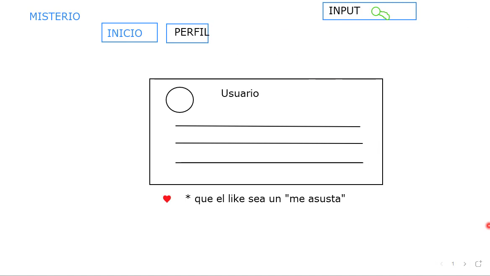
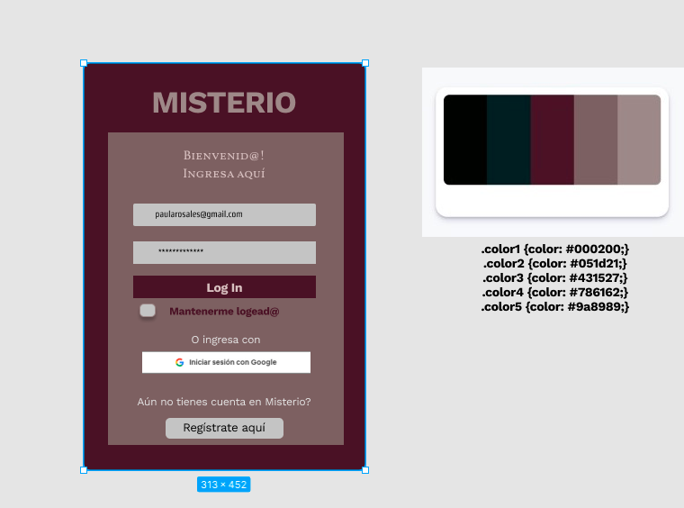

# MISTERIO
Misterio es una red social donde los usuarios pueden compartir sus experiencias, historias o creaciones relacionadas al misterio, ya sean paranormales, policiales o alienígenas.
La forma de compartir estas historias con otros usuarios es por medio de post escritos los cuales se pueden editar, borrar y dar me 'asusta' como signo de gusto o preferencia.

## Investigación UX:
Hicimos un Google form para hacer una investigacion de usuario e identificar sus preferencias y lo que les gustaria ver en una red social de misterio, a continuacion enlazamos los resultados. 
https://docs.google.com/document/d/1Nrw-8Pehk485_xx1nLZyetgfuRfp-cslcyD6cJ5rtyw/edit

## Historias de usuario
Tomamos en cuenta los conceptos y sugerencias de las encuestas para crear las Historias de Usuario, asi definimos 
10 historias de usuario y a partir de estas seguimos los principios que se requieren para crear cada una de ellas como:

### HU #1 Registro con correo
Yo como usuario QUIERO poder registrarme con mi correo personal sea éste Google o de otro tipo PARA loguerme en esta cuenta.
### HU #2Registro con Google
Yo como usuario QUIERO poder ingresar con un correo de Google PARA acceder más rápido a la red social.
### HU #3 Login con correo
Yo como usuario de la red social me gustaría loguearme con mi correo electrónico PARA poder acceder a ella de forma segura y ver su contenido.
### HU #4 Login con Google
Yo como usuario de la red social me gustaría loguearme con mi cuenta de Google PARA poder acceder a la red social de manera mas rápida.
### HU #5 Agregar un Post
YO como usuario de MISTERIO QUIERO poder hacer publicaciones relacionadas a casos de misterio en mi muro PARA compartir con los demás usuarios
### HU #6 Eliminar un Post
YO como usuario de MISTERIO QUIERO poder eliminar publicaciones en caso de que ya no quiera compartir ese contenido.
### HU #7 Editar un Post
YO como usuario de MISTERIO QUIERO poder editar un post PARA corregirlo en caso de haberme equivocado.
### HU #8 Dar Like
YO como usuario de MISTERIO QUIERO poder dar like a las publicaciones que me agraden PARA interactuar con otros usuarios.
### HU #9 Cerrar sesión
YO como usuario de MISTERIO QUIERO salir de la página cuando ya no desee estar en ella PARA que nadie más pueda acceder a mi perfil.
### HU #10 Dar Dislike
YO como usuario de MISTERIO QUIERO poder quitar un like a las publicaciones cuando ya no me gustan o me equivoco al clickear.

## Prototipo de baja fidelidad

Este prototipo es de como queriamos que se viera el muro de la red social lo diseñamos en pizarra de zoom y creemos que si se asemeja al resultado final.

## prototipo alta fidelidad.

Recibimos feedback del prototipo de alta fidelidad con respecto al contraste de colores y estetica del diseño.
Despues de algunos consejos y reseñas de otros proyectos elegimos un template el cual se ajustaba mas al tema de nuestra red social y se veía mas armónico y profesional.

### La imagen final de tu proyecto.

